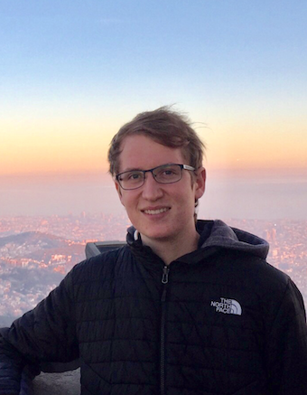

    
 

    
I am a fifth year graduate student in mathematics at Northwestern, advised by <a href="https://sites.northwestern.edu/getzler/">Ezra Getzler</a>. I am interested in algebraic topology and algebraic geometry. Currenty, I am thinking about cobordism theory and intersection theory on the moduli space of curves. 
  

Here is my [CV](./CV.pdf).

### Papers and preprints

### Other writings

My undergraduate thesis, entitled [The Klein four homotopy Mackey functor structure of HF_2](./thesis.pdf).

### Expository Writings

* [The local Atiyah-Singer index theorem over four-manifolds](./Atiyah-Singer_index_theorem.pdf)
* [The Atiyah-Segal completion theorem](./VBKT_Report.pdf)
* [Universal C\*-algebras, semiprojectivity and graph C\*-algebras](./Operator_algebras.pdf)
* [Yang-Mills theory on Riemann surfaces](./Yang-Mills_Riemann_surfaces.pdf)
* [Infinite-dimensional Ramsey theory](./Ramsey_theory.pdf)
